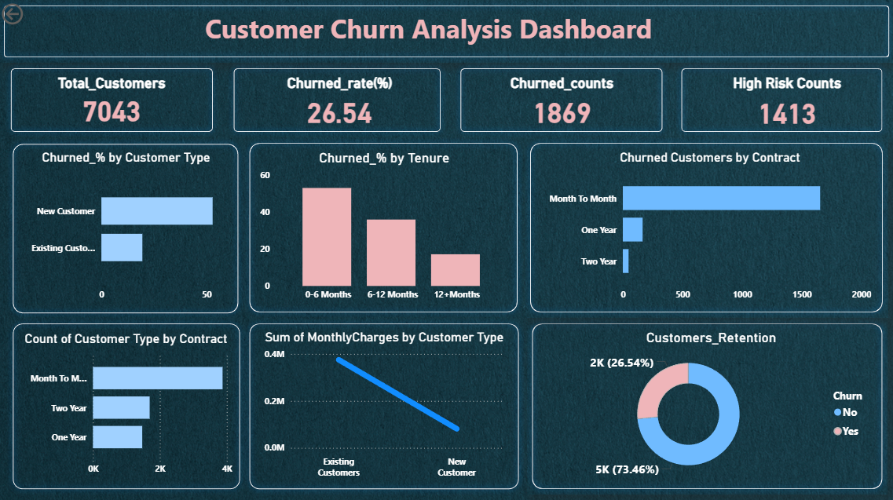

<h1 align="center">📊 Power BI Customer Churn Analysis Dashboard</h1>

Data Cleaning • DAX • Business Insights • Retention Strategy

---

##  Tech Stack

---

##  Executive Summary

This project analyzes **7,043 telecom customers** and identifies a **26.54% churn rate**.  

The analysis reveals that churn is significantly higher among:
- Customers in their first 6 months  
- Month-to-Month contract users  

Data-driven retention strategies were developed to reduce churn and improve long-term revenue stability.

---

##  Business Problem

The telecom company is experiencing high customer attrition, impacting recurring revenue and customer lifetime value.

### Objectives:

- Identify key drivers of churn  
- Segment high-risk customers  
- Analyze tenure and contract impact  
- Provide actionable business recommendations  

---

##  Dataset Information

- Total Customers: 7,043  
- Churned Customers: 1,869  
- Churn Rate: 26.54%  
- High-Risk Customers: 1,413  

###  Dataset Access

- [View Dataset on GitHub](https://github.com/Aniket-Rawat071199/power_bi_customer_churn_analysis/blob/main/dataset/telco_churn_dataset.csv)  

---

##  Data Cleaning & Preparation

The following preprocessing steps were performed:

- Removed duplicate records  
- Trimmed extra spaces  
- Standardized categorical values (Yes/No formatting)  
- Replaced null values in pricing columns with 0  
- Created derived columns  
- Developed DAX measures for KPI tracking  

---

##  Feature Engineering

New columns created:

- Customer Type (New / Existing)  
- Tenure Group (0–6, 6–12, 12+ months)  
- High Risk Flag  

---

##  Dashboard KPIs

- Total Customers  
- Churn Count  
- Churn Rate %  
- High Risk Customers  
- Revenue Contribution  

---

##  Key Insights

1. Customers in their first 6 months show the highest churn rate.  
2. Month-to-Month contracts drive maximum churn.  
3. Long-term contracts significantly reduce churn probability.  
4. Existing customers contribute higher revenue.  
5. Nearly 1 in 4 customers leave — indicating urgent retention needs.  

---

##  Business Recommendations

- Improve onboarding experience during first 6 months  
- Offer incentives for yearly and two-year contracts  
- Identify and target high-risk customers early  
- Implement structured loyalty programs  
- Introduce bundled service pricing models  

---

##  Business Impact

If implemented, these strategies could:

- Reduce early-stage churn by 10–15%  
- Increase long-term contract adoption  
- Improve customer lifetime value  
- Protect recurring revenue streams  

---

##  Project Workflow

1. Data Collection  
2. Data Cleaning & Standardization  
3. Feature Engineering  
4. KPI Creation using DAX  
5. Dashboard Design in Power BI  
6. Business Insight Generation  

---

##  Dashboard Preview

---

##  Project Presentation

 [View Full Presentation](https://drive.google.com/file/d/1tMoi1YfLBxjJpTCpoP6TxOLOC2qtAQ6i/view?usp=sharing)

---

##  Future Improvements

- Build churn prediction model using Machine Learning  
- Deploy dashboard to Power BI Service  
- Automate data refresh pipeline  
- Perform advanced customer segmentation  

---

##  Author

**Aniket Rawat**  
Aspiring Data Analyst | Power BI | SQL | Excel  

Linkedin :- 

Gmail :- 

Github :-  

